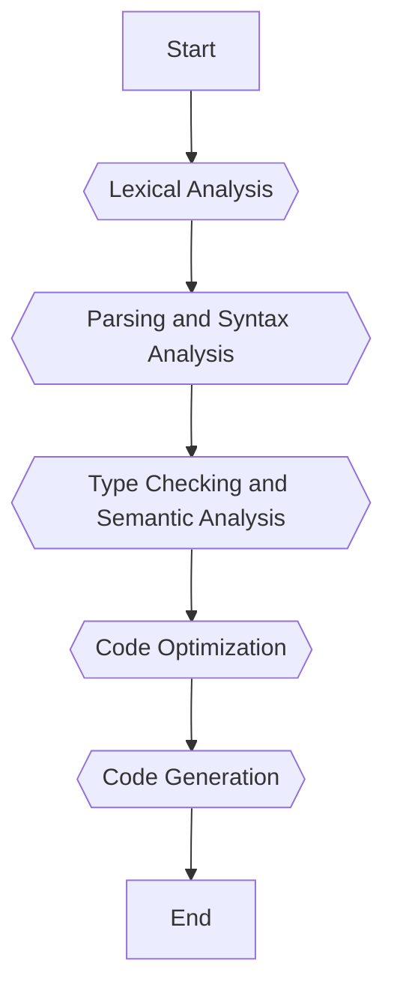

# goProgramming


# Why Golang?
Golang, also known as Go, is an open-source programming language developed by Google to address the challenges of modern software development. It combines simplicity, performance, and scalability, making it an ideal choice for a wide range of applications, from web development to distributed systems.

## Key Features and Advantages

- **Fast Compilation**: Golang compiles directly to machine code, eliminating the need for a virtual machine (VM) like JVM. This results in faster compilation and execution.
- **Memory Management**: Built-in garbage collection ensures efficient memory usage and prevents leaks.
- **Garbage Collector**: The low-latency garbage collector helps optimize performance without manual intervention.
- **Concurrent Programming**: Golang’s goroutines and channels enable efficient concurrency, allowing multiple tasks to run simultaneously.
- **Distributed Programming**: Designed for large-scale distributed systems, making it ideal for server environments and cloud applications.
- **High Performance**: Direct compilation to machine code ensures superior performance compared to interpreted languages like Python.
- **Security**: Golang’s simplicity and strict typing reduce vulnerabilities, ensuring safer code execution.
- **Productivity**: Features like automatic variable declaration and fast compilation enhance developer productivity.
- **Community Support**: A strong and active developer community provides extensive resources and support.
- **Cross-Platform Compatibility**: Golang allows developers to compile executables for multiple operating systems (Windows, Linux, macOS).
  
---

## How Golang Works
The Go programming language is a statically-typed, compiled language designed for simplicity, performance, and scalability. The Go compiler transforms human-readable Go code into optimized machine code that can run on different hardware architectures. Here's an overview of how the Go compilation process works.

## Compilation Process Overview

The Go compiler operates in several key stages:


---

### 1. **Lexical Analysis**
- The source code is tokenized into smaller components, such as keywords, identifiers, and symbols.
- This process ensures that the code adheres to the basic syntax rules of the Go language.
- **What is Lexer ?**
    -    The lexer checks the syntax of the code before pre-compilation, ensuring proper grammar rules are followed (e.g., semicolons). Go automatically removes unnecessary semicolons during compilation.

### 2. **Parsing and Syntax Analysis**
- The tokenized code is analyzed to construct a **syntax tree** (Abstract Syntax Tree or AST).
- The syntax tree represents the structure of the code, mapping elements like expressions, declarations, and statements.
- Errors in syntax are reported at this stage.

### 3. **Type Checking and Semantic Analysis**
- The compiler verifies that types are used correctly in the program.
- Semantic analysis ensures that the program follows logical rules, such as variable declarations and function calls.

### 4. **Code Optimization**
- The compiler optimizes the intermediate representation (IR) of the program to improve performance.
- Redundant operations are removed, and efficient execution paths are created.

### 5. **Code Generation**
- The optimized IR is translated into machine-specific instructions.
- The final output is a platform-specific executable binary file.

---

## Key Features of the Go Compiler

1. **Standalone Executables**: 
   - The Go compiler produces a single binary file that includes all dependencies.
   - No external runtime environment (like JVM) is required to execute the program.

2. **Cross-Compilation**:
   - Developers can compile programs for different operating systems and architectures by setting environment variables:
     ```
     GOOS="windows" GOARCH="amd64" go build   # For Windows
     GOOS="darwin" GOARCH="arm64" go build    # For macOS (ARM)
     GOOS="linux" GOARCH="amd64" go build     # For Linux
     ```
   - This feature simplifies deployment across diverse environments.

3. **Optimizations**:
   - The compiler performs inlining (e.g., replacing function calls with their body) to reduce overhead.
   - Efficient register allocation and instruction scheduling improve performance on target hardware.

4. **Error Reporting**:
   - Errors are reported with precise location details during parsing and type-checking phases.

---
## Where to Use Golang
- From system applications to web apps, especially cloud-based solutions.
- Already widely adopted by major platforms like Google, Kubernetes, Docker, Dropbox, and Uber.

---

- **Minimal Baggage**: Golang avoids unnecessary complexity by excluding features like operator overloading, method overloading/overriding, try/catch blocks, inheritance, and classes.
- **Is IT Object-Oriented? Yes and No**: While Go supports structs and methods (object-oriented principles), it avoids traditional class-based inheritance for simplicity.

---

## Missed Features in Go
1. No operator overloading.
2. No method overloading or overriding.
3. No try/catch blocks—error handling is explicit.
4. No inheritance or classes—focuses on composition.

---

## Types in Golang
### Core Types
1. Strings  
2. Booleans  
3. Integers: `uint8`, `uint64`, `int8`, `int64`, `uintptr`  
4. Floating-point numbers: `float32`, `float64`  
5. Complex numbers  

### Data Structures
- Arrays  
- Slices  
- Maps  
- Pointers  
- Structs  

### Advanced Constructs
- Functions  
- Channels

---
# Compiling and Running Your First Go Program

This guide will walk you through creating, compiling, and running your first Go program.

---
## Step 1: Set Up Your Go Program\
### Create a New Directory and Navigate to It
Create a new directory named `firstProgram` and navigate into it:
#### Examples
```
  mkdir firstProgram
  cd firstProgram
```

### Initialize a Go Module
Use `go mod init` to initialize a new Go module:
#### Examples
```
go mod init firstprogram
```
### Create Your Go Program
Create a file named `main.go` and add the following code:
#### Examples
```
  touch main.go
```
```
import "fmt"

func main() {
    fmt.Println("Hello, World!")
}
```
---
## Step 2: Compile the Program
Use the `go build` command to compile your program:
#### Examples
```
  go build main.go
```
This will generate an executable binary named `main` in the same directory.

---
## Step 3: Run the Program
Execute the compiled binary directly:
```
  ./main
```
You should see the output:

---
### Tips for Beginners

- Ensure you have Go installed on your system. You can download it from the [official Go website](https://go.dev/dl/).
- Use `go run main.go` as an alternative to compile and run your program in one step.
- Explore more about Go modules and dependencies with `go mod tidy` and `go mod vendor`.

---

Happy coding with Go!
